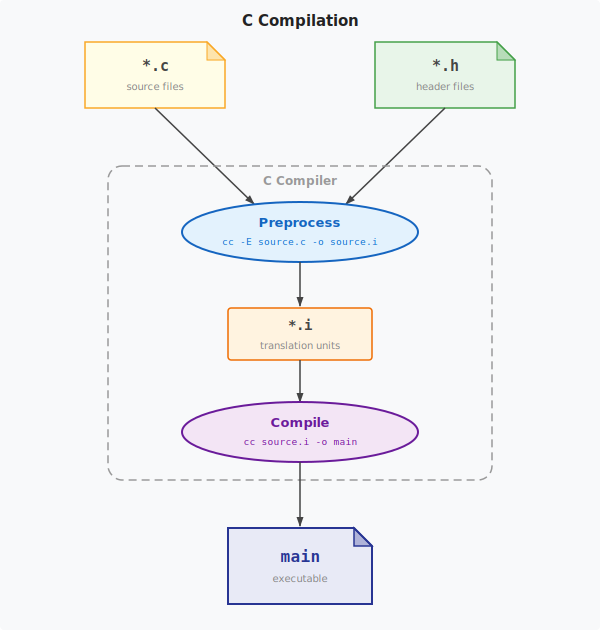

# Parcel Translation

Parcel translation generates the `export/` and `import/` _include_ files that express the modular semantics in standard C. The translator runs _before_ the C preprocessor. It scans the C source files for `#pragma parcel` declarations along with the necessary _export_- and _import_ `#include` directives. It generates the corresponding _export_ and _import_ files which the regular C preprocessor includes during the subsequent _build_ step, leaving the compiler toolchain otherwise unchanged.

<figure>
  
</figure>

<figure>
  
</figure>

## Diagnostics

The translator validates parcel declarations across all scanned source files and emits diagnostics at two severity levels.

### Errors

Error messages indicate input conditions from which the translator cannot generate correct output. Consequently, the affected `export/` and `import/` files are not generated.

**Undefined identifier.** An identifier listed in a `#pragma parcel` declaration has no corresponding C definition in the same translation unit, i.e., file.

**Orphan export.** A file contains `#include "export/<path>/<name>"` but no `#pragma parcel <name>` declaration. The translator has no interface from which to generate the export file.

**Undefned export.** A file contains `#include "import/<path>/<name>.<stem>"` but with no corresponding `#include "export/..."` statement for that parcel name. The translator has no interface from which to derive the _import_ file.

**Path-name collision.** Two distinct `<path>/<name>` pairs produce the same canonical prefix after replacing `/` with `_`. For example, path `foo_bar` with name `p` and path `foo` with name `bar_p` both yield the prefix `foo_bar_p_`. Any identifiers exported by either parcel would receive identical canonical names, making the generated files mutually incompatible. This collision cannot be resolved at the identifier level; it is an error regardless of whether the affected parcels share any identifier names. It must be resolved by renaming one of the paths or parcel names.

**Stem collision.** Two `#include "import/..."` directives in the same file apply the same stem. Identifiers from both parcels would be emitted under the same prefix, causing unintended typedef redefinition, i.e., _shadowing_.

### Warnings

Warning messages indicate parcel declarations that do not prevent generation but are likely to cause compile-time failures or unintended behaviour.

**Unexported parcel.** A `#pragma parcel` declaration has no `#include "export/..."` following it in the file. The parcel is declared but never exported.

**Exported static identifier.** An identifier listed in a `#pragma parcel` declaration is declared `static` in the same file. Static identifiers have internal linkage and are not accessible to importers; the generated export file will compile but the exported name will be unusable in other translation units.

**Canonical name conflict.** A user-defined identifier in the file has the same spelling as a canonical name the translator is about to generate (for example, a local definition of `foo_p_T` in `foo.c`). The generated typedef will produce a redefinition error at compile time.

**Duplicate interface identifier.** The same identifier is listed more than once for the same parcel. This warning also applies where the same identifier appears in different `#pragma parcel` declarations for the same parcel. (See the note, _Cumulative parcel identifiers_.) 

**Unused import.** A parcel import applies `<stem>` but no corresponding `<stem>`-qualified identifiers appearing in the C code.

## Notes

**Cumulative parcel identifiers.** It is valid for multiple parcel declarations to appear in the same file with the same parcel name. Such a set of declarations is equivalent to a single parcel declaration at the position of the last statement, but with the cumulative set of identifiers from all statements listed. Note that the _Duplicate interface identifier_ warning still applies.
