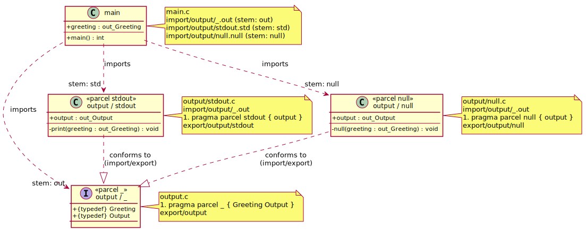

# Hello, World!

This example shows how the Parcel language supports **modular abstraction** and **software re-use** through a small program that prints `Hello, world!` — or deliberately does not.

## Motivation

A recurring problem in C is that a module's interface and its implementation are inseparable: a header exposes types and declarations, but there is no language mechanism to say _this set of identifiers is the interface_ and _these files are alternative implementations of it_. The result is that callers depend on concrete implementations rather than abstractions, making it hard to substitute behaviour (e.g. for testing, platform variation, or feature selection) without changing call sites.

Parcel addresses this directly. An interface is expressed as a parcel whose identifiers name the types and behaviours that implementations must provide. Any number of implementation files can import that interface and export a conforming parcel. Call sites import whichever implementation they need, and the types remain consistent across all of them.

## Files

```
output.c            ← interface: defines Greeting and Output types
output/
  stdout.c          ← implementation: prints to standard output
  null.c            ← implementation: discards output silently
main.c              ← consumer: calls both implementations
```

## Module structure



The interface parcel (`output/_`) defines only types. Both implementation parcels (`output/stdout` and `output/null`) conform to it independently. The consumer (`main`) imports all three, using stems to scope their identifiers at call sites — `out_Greeting` for the typedef, `std->output` and `null->output` for the function pointers.

## The interface parcel (`output.c`)

`output.c` defines the shared vocabulary for all output implementations: a `Greeting` type and an `Output` function-pointer type. It declares and exports a **default parcel** (`_`), placing it in the `output` namespace.

```c
#pragma parcel _ { Greeting Output }
#include "export/output"

typedef char *Greeting;
typedef void (*Output)(Greeting greeting);
```

The interface contains no behaviour — only types. Both `Greeting` and `Output` are typedefs, so implementations import them using the **typedef stem prefix** form (`stem_Identifier`).

## Implementation parcels

Each implementation imports the interface with stem `out` and exports its own **named parcel** containing a single `output` variable — a function pointer conforming to `out_Output`.

### `output/stdout.c`

```c
#include <stdio.h>

#include "import/output/_.out"

#pragma parcel stdout { output }
#include "export/output/stdout"

static void print(out_Greeting greeting) {
    printf("%s\n", greeting);
}

out_Output output = print;
```

The `print` function is `static` — it is an internal implementation detail, invisible outside this file. Only the `output` function pointer is in the parcel interface. Callers see the abstraction (`output`), not the mechanism (`print`).

### `output/null.c`

```c
#include "import/output/_.out"

#pragma parcel null { output }
#include "export/output/null"

static void null(out_Greeting greeting) {
}

out_Output output = null;
```

The null implementation fulfils the same interface with a body that does nothing. It is a valid substitute wherever `stdout` is used — call sites do not change.

## The consumer (`main.c`)

`main.c` imports the interface parcel (for the `out_Greeting` type) and both implementations, then calls each `output` through its stem.

```c
#include "import/output/_.out"
#include "import/output/stdout.std"
#include "import/output/null.null"

out_Greeting greeting = "Hello, world!";

int main() {
    std->output(greeting);
    null->output(greeting);
    return 0;
}
```

`std->output` and `null->output` use the **variable/function stem pointer** form — `stem->identifier` — because `output` is a variable (a function pointer) in each implementation's interface. The `out_Greeting` type, being a typedef, uses the **typedef stem prefix** form.

Both calls share the same `greeting` value and the same `out_Output` type, because both implementations are bound to the same interface parcel.

## Concept map

| Concept | Where |
|--|--|
| Default parcel (`_`) | `output.c` — `#pragma parcel _ { Greeting Output }` |
| Named parcel | `output/stdout.c` — `#pragma parcel stdout { output }` |
| Named parcel | `output/null.c` — `#pragma parcel null { output }` |
| Typedef in interface | `output.c` — `Greeting`, `Output` |
| Variable in interface | `output/stdout.c`, `output/null.c` — `output` |
| Export with namespace path | `output.c` — `export/output` |
| Export with namespace path | `output/stdout.c` — `export/output/stdout` |
| Export with namespace path | `output/null.c` — `export/output/null` |
| Import with stem | `output/stdout.c`, `output/null.c` — `import/output/_.out` |
| Import with stem | `main.c` — `import/output/stdout.std`, `import/output/null.null` |
| Typedef stem prefix | `output/stdout.c`, `output/null.c` — `out_Greeting`, `out_Output` |
| Typedef stem prefix | `main.c` — `out_Greeting` |
| Variable stem pointer | `main.c` — `std->output`, `null->output` |
| Modular abstraction | `output.c` separates interface from implementation |
| Software re-use | `main.c` uses both implementations without changing call sites |
